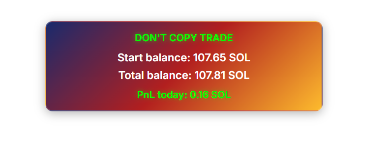
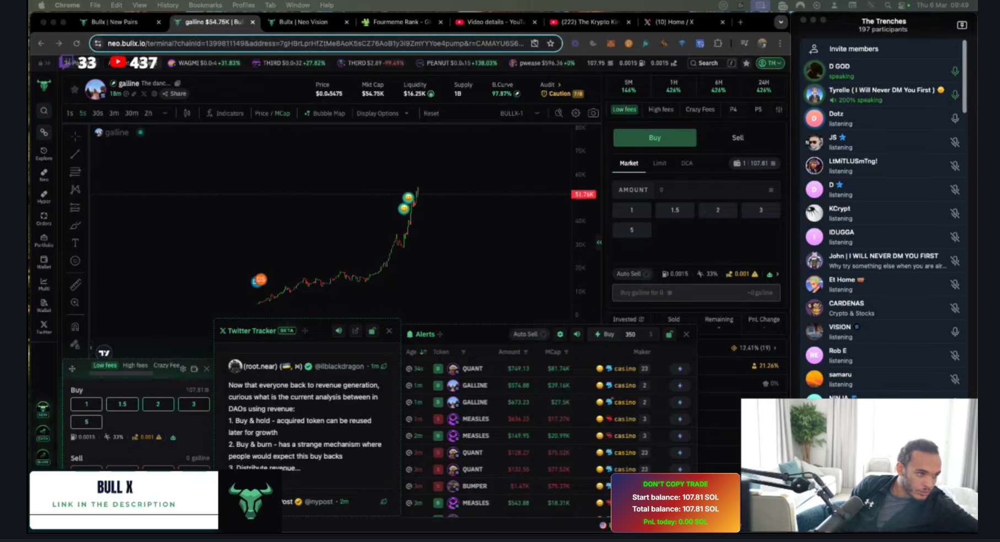
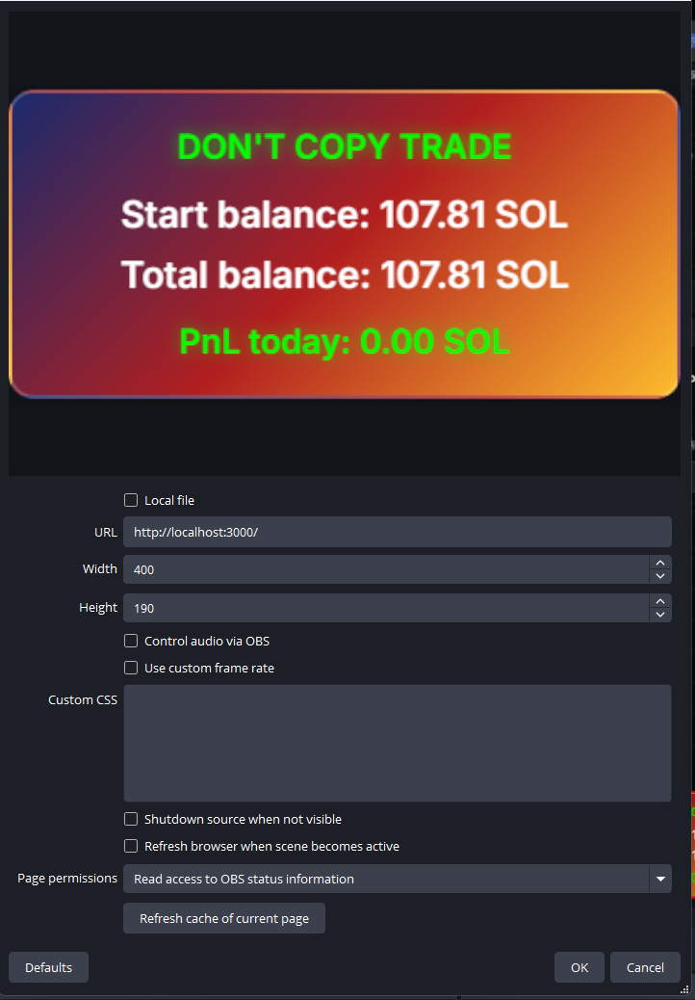

# **OBS Crypto Balance Widget**   

A **real-time Solana balance tracker** designed for **OBS Studio**. This widget displays your **start balance, total balance, and daily PnL** with a **modern gradient UI** inside OBS. Work on MacOs and Windows.  

- 🔹 **Live SOL balance updates (every 2-30s, configurable)**  
- 🔹 **PnL tracking since stream start**  
- 🔹 **Customizable size (e.g., `node index.js 500`)**  
- 🔹 **Modern UI with smooth gradients & shadows**  
- 🔹 **Lightweight, fast, and easy to set up**  

---

## ** Preview**  

### ** How it looks in the browser**  
This is how the widget appears when opened in a browser.  
  

### ** How it looks inside OBS**  
Your **real-time balance widget** inside an OBS stream.  
  

### ** OBS Browser Source Settings**  
Here’s how to **correctly set up** the widget inside OBS Studio.  
  

---

## ** Installation Guide**  

### ** Install Node.js**  
Download and install **Node.js (LTS version)** from [nodejs.org](https://nodejs.org/).  
To check if Node.js is installed, run:  
```sh
node -v
```

### ** Clone this repository**  
Open a terminal and run:  
```sh
git clone https://github.com/yourusername/obs-crypto-widget.git
cd obs-crypto-widget
```

### ** Install dependencies**  
Run the following command inside the project folder:  
```sh
npm install
```

### ** Configure the widget**  
Edit `config.json` to set your Solana wallet, API, and update interval:  
```json
{
    "SOLANA_WALLET": "your_wallet_address",
    "SOLANA_API": "https://solana.publicnode.com",
    "UPDATE_INTERVAL": 5050
}
```
- `SOLANA_WALLET` → Your Solana wallet address  
- `UPDATE_INTERVAL` → Balance update frequency (2000 - 30000ms)  

### ** Start the widget**  
Run the following command (default width: 500px):  
```sh
node index.js 500  # 500px width
```
 The height auto-adjusts (30% of the width).

---

## ** How to Add the Widget to OBS**  

### ** Open OBS Studio**  
Go to: **Sources → Add → Browser**  

### ** Set the URL to:**  
```sh
http://localhost:3000
```

### ** Configure the source**  
- Set width: (same as terminal, e.g., **500px**)  
- Enable **"Transparent Background"**   
- Click **OK** – your **real-time Solana widget** is now inside OBS!  

---

## ** Available Commands**  
| Command | Description |
|---------|-------------|
| `node index.js 500` | Start the widget with a width of 500px (height auto-adjusts). |
| `node index.js 700` | Start the widget with a width of 700px. |
| `npm install` | Install required dependencies. |
| `npm start` | Start the widget (defaults to 400px). |

---

## ** Troubleshooting**  

### ** Widget is not updating**  
- Make sure **Node.js is running** (`node index.js 500`).  
- Check if your **wallet address is correct** (`config.json`).  
- Ensure **OBS browser source** is set to `http://localhost:3000`.  

### ** I see "Cannot GET /" error**  
- Make sure the `public/index.html` file exists.  
- Restart the server:  
```sh
node index.js 500
```

### ** How do I customize the design?**  
- Modify `public/index.html` and CSS styles inside the `<style>` tag.  
- Change colors, fonts, and layout to match your stream theme!  

---

## ** Contributing**  
Feel free to **fork** this repository, make improvements, and **submit a pull request!** 🚀  

---

## ** Questions & Custom Requests**  
If you have any **questions** or want to create something **unique**, feel free to message on Telegram: [https://t.me/solanatowin](https://t.me/solanatowin)  

---

## ** License**  
This project is **open-source** and available under the **MIT License**.  

Happy streaming! 

